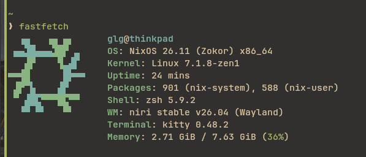

## My NixOS Configuration
KERNEL = "Linux Zen";

WM = "niri";

SH = "zsh"; # with oh-my-zsh

USER SHELL = "noctalia"; # v5

TERMINAL = "kitty";

SYSTEM FLAKE = [ happ, zapret ];

USER FLAKE = "niri-flake";

